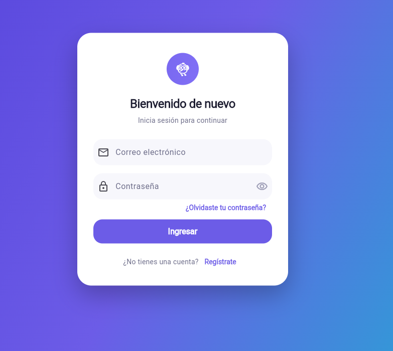

# Tuki

> Una base Flutter limpia para construir una experiencia movil con identidad.

## Información del Aprendiz

| Dato                     | Valor                                          |
| ------------------------ | ----------------------------------------------- |
| Nombre                   | Vicente Ríos                                    |
| Número de Ficha          | 3256538                                         |
| Programa de Formación    | Análisis y Desarrollo de Software (ADSO)        |
| Institución               | SENA                                            |

## 📝 Descripción del Proyecto

Tuki es una aplicacion Flutter enfocada en una navegacion clara y modular. El proyecto incluye el flujo visual de bienvenida, autenticacion, actividad reciente y perfil, listo para crecer hacia una experiencia conectada a servicios reales.

## 🎯 Objetivo de la Actividad

Aplicar los conocimientos de desarrollo móvil con Flutter para construir una aplicación multipantalla con navegación nombrada, un sistema de diseño consistente (tema, colores, componentes reutilizables) y una experiencia de usuario moderna, sentando las bases para integrar en un futuro autenticación real y consumo de servicios.

## 📚 Temas Trabajados

- Estructura de proyectos Flutter por *features* (auth, dashboard, profile, splash).
- Rutas nombradas y navegación entre pantallas (`Navigator`, `AppRoutes`).
- Manejo de estado con `StatefulWidget` y `setState`.
- Formularios y validación básica (login, registro, recuperación de contraseña).
- Sistema de diseño centralizado con Material 3 (`ThemeData`, `ColorScheme`, tipografías).
- Widgets reutilizables (encabezados con degradado, tarjetas de formulario, tarjetas de menú).
- Componentes visuales modernos: gradientes, sombras, bordes redondeados y animaciones (`AnimationController`).
- Buenas prácticas de organización de código (`core/` y `features/`).

## ⚡ Instrucciones para Ejecutar el Programa

### Requisitos

- Flutter instalado y disponible en el `PATH`.
- Dart SDK compatible con `^3.9.2`.
- Un dispositivo, emulador o navegador configurado.

### Ejecutar

```bash
git clone <url-del-repositorio>
cd UserMaster
flutter pub get
flutter run
```

### Ejecutar el build web desplegado

El directorio `build/web` contiene la version compilada de la aplicacion para
navegadores. Para generarlo nuevamente y ejecutarlo localmente:

```bash
flutter pub get
flutter build web --release
py -m http.server 8000 --directory build/web
```

Luego abre [http://localhost:8000](http://localhost:8000) en el navegador.

El servidor debe iniciarse sobre `build/web` porque el build necesita cargar
sus archivos JavaScript, fuentes, iconos y recursos estaticos con rutas HTTP.
Para detenerlo, presiona `Ctrl+C` en la terminal.

Si el comando `py` no esta disponible, usa:

```bash
python -m http.server 8000 --directory build/web
```

Para revisar el entorno local:

```bash
flutter doctor
```

### Comandos útiles

```bash
# Analisis estatico
flutter analyze

# Tests
flutter test

# Formateo
dart format lib

# Ejecutar en una plataforma concreta
flutter run -d chrome
flutter run -d windows
```

## 📸 Evidencia de Ejecución

| Inicio de sesión | Dashboard |
| --- | --- |
|  |  |

## Stack

| Tecnologia        | Uso                        |
| ----------------- | -------------------------- |
| Flutter           | Aplicacion multiplataforma |
| Dart 3.9+         | Lenguaje principal         |
| Material 3        | Sistema visual             |
| `cupertino_icons` | Iconografia complementaria |

## Estructura

```text
lib/
|-- main.dart
|-- core/
|   |-- routes/       # Rutas nombradas de la aplicacion
|   |-- theme/        # Colores y configuracion visual
|   `-- widgets/      # Componentes reutilizables (headers, tarjetas)
`-- features/
    |-- auth/         # Login, registro y recuperacion
    |-- dashboard/    # Inicio y actividad reciente
    |-- profile/      # Perfil del usuario
    `-- splash/       # Pantalla inicial
```

## Rutas disponibles

| Ruta               | Pantalla             |
| ------------------ | --------------------- |
| `/`                | Splash                |
| `/login`           | Iniciar sesion        |
| `/register`        | Registro               |
| `/forgot-password` | Recuperar contrasena  |
| `/dashboard`       | Dashboard              |
| `/profile`         | Perfil                 |

